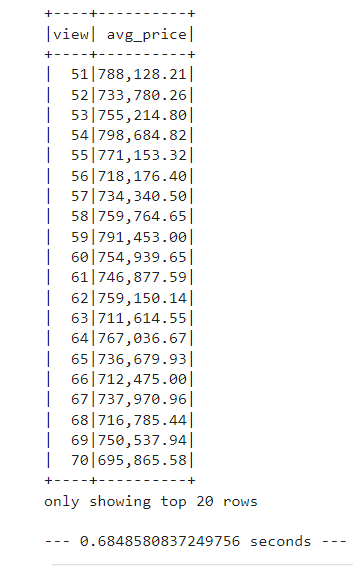
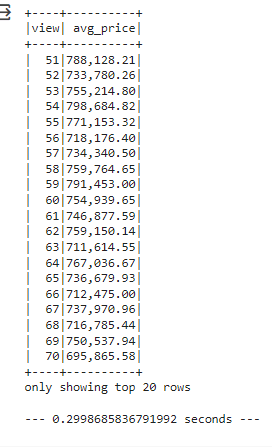
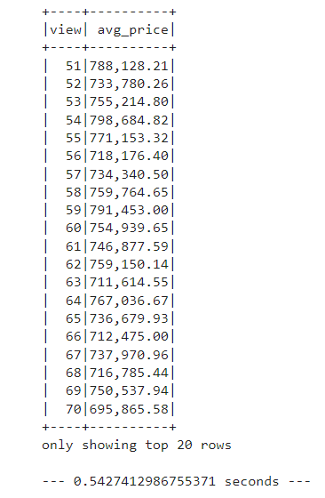

# Home_Sales

In this challenge, we will use SparkSQL to determine key metrics about home sales data. 

## What we will learn from this project:

- How to read a csv data into a Spark DataFrame

- How to create a temporary table

- How to cache a temporary table

- How to partition by a chosen field on a formatted parquet

- Hoe to create a temporary table for the parquet data.

- How to answer questions using SparkSQL
## Instructions:

- Import the necessary PySpark SQL functions.

- Read a csv data into a Spark DataFrame.

- Create a temporary table

- Answer the following questions using SparkSQL about:

  - The average price for a four-bedroom house sold for each year

  - The average price of a home for each year it was built that has three bedrooms and three bathrooms

  - The average price of a home for each year that has three bedrooms, three bathrooms, two floors, and is greater than or equal to 2,000 square feet

  - The view ratings with an average price of greater than or equal to $350,000 and the runtime of the query

- Cache your temporary table.

- Check if your temporary table is cached.

- Using the cached data, run the query that filters out the view ratings with an average price of greater than or equal to $350,000. Determine the runtime and compare it to uncached runtime.

- Partition by the "date_built" field on the formatted parquet home sales data.

- Create a temporary table for the parquet data.

- Run the query that filters out the view ratings with an average price of greater than or equal to $350,000. Determine the runtime and compare it to uncached runtime.

- Uncache the temporary table.

- Verify that the home_sales temporary table is uncached using PySpark.

## Program:

### Tools:

- Google Colab: is a free, cloud-based service provided by Google to write and execute Python code.

- Python: is a high-level programming language known for its simplicity, readability, and versatility. 

- PySpark: is the Python library for Apache Spark.

- Apache Spark: is an open-source, distributed processing system  for big data processing.

### Code:

#### Import data:

```
# Read in the AWS S3 bucket into a DataFrame.
from pyspark import SparkFiles
url = "https://2u-data-curriculum-team.s3.amazonaws.com/dataviz-classroom/v1.2/22-big-data/home_sales_revised.csv"
spark.sparkContext.addFile(url)
home_sale_df = spark.read.csv(SparkFiles.get("home_sales_revised.csv"), sep=",", header=True)

# Show the home sale data.
home_sale_df.show()
# Create a temporary view of the DataFrame.
home_sale_df.createOrReplaceTempView("home_sales")
```
#### Run queries on the virtual table

```
#  What is the average price for a four bedroom house sold in each year rounded to two decimal places?
q1= spark.sql("""
    SELECT YEAR(date) AS year_sold, FORMAT_NUMBER(ROUND(AVG(price), 2), 2) AS avg_price
    FROM home_sales
    WHERE bedrooms = 4
    GROUP BY year_sold
    ORDER BY year_sold
""").show()

#  What is the average price of a home for each year the home was built that have 3 bedrooms and 3 bathrooms rounded to two decimal places?
q2 = spark.sql("""
    SELECT date_built AS year_built, FORMAT_NUMBER(ROUND(AVG(price), 2), 2) AS avg_price
    FROM home_sales
    WHERE bedrooms = 3 AND bathrooms = 3
    GROUP BY year_built
    ORDER BY year_built
""").show()

# What is the average price of a home for each year built that have 3 bedrooms, 3 bathrooms, with two floors,
# and are greater than or equal to 2,000 square feet rounded to two decimal places?
q3 = spark.sql("""
 SELECT date_built AS year_built, FORMAT_NUMBER(ROUND(AVG(price), 2), 2) AS avg_price
 FROM home_sales
 WHERE bedrooms = 3
  AND bathrooms = 3
  AND floors = 2
  AND sqft_living >= 2000
 GROUP BY year_built
 ORDER BY year_built
""").show()

# What is the "view" rating for the average price of a home, rounded to two decimal places, where the homes are greater than
# or equal to $350,000? Although this is a small dataset, determine the run time for this query.

start_time = time.time()

q4 = spark.sql("""
SELECT view, FORMAT_NUMBER(ROUND(AVG(price), 2), 2) AS avg_price
FROM home_sales
GROUP BY view
HAVING AVG(price) >= 350000
ORDER BY CAST(view AS INT)
""").show()

print("--- %s seconds ---" % (time.time() - start_time))
```
#### Cache the virtual table:

```
# Cache the the temporary table home_sales.
spark.sql("CACHE TABLE home_sales")

# Check if the table is cached.
res =spark.catalog.isCached('home_sales')
if res: print ('cached')
else: print ('not cached')

# Using the cached data, run the query that filters out the view ratings with average price
#  greater than or equal to $350,000. Determine the runtime and compare it to uncached runtime.
start_time = time.time()

q5 = spark.sql("""
SELECT view, FORMAT_NUMBER(ROUND(AVG(price), 2), 2) AS avg_price
FROM home_sales
GROUP BY view
HAVING AVG(price) >= 350000
ORDER BY CAST(view AS INT)
""").show()

print("--- %s seconds ---" % (time.time() - start_time))
```

#### Partition the cached virtual table:

```
# Partition by the "date_built" field on the formatted parquet home sales data
home_sale_df.write.partitionBy("date_built").mode("overwrite").parquet("date_built_partitioned")

# Read the parquet formatted data.
partitioned_home_sale_df = spark.read.parquet("date_built_partitioned")

# Create a temporary table for the parquet data.
partitioned_home_sale_df.createOrReplaceTempView("partitioned_home_sale")

# Run the query that filters out the view ratings with average price of greater than or equal to $350,000
# with the parquet DataFrame. Round your average to two decimal places.
# Determine the runtime and compare it to the cached version.

start_time = time.time()

q6 = spark.sql("""
SELECT view, FORMAT_NUMBER(ROUND(AVG(price), 2), 2) AS avg_price
FROM partitioned_home_sale
GROUP BY view
HAVING AVG(price) >= 350000
ORDER BY CAST(view AS INT)
""").show()

print("--- %s seconds ---" % (time.time() - start_time))

# Uncache the home_sales temporary table.
spark.sql("UNCACHE TABLE home_sales")

# Check if the home_sales is no longer cached
res =spark.catalog.isCached('home_sales')
if res: print ('cached')
else: print ('not cached')
```

## Comparison of the Runtimes for Three Executions of the Query on View Ratings with an Average Price of Greater Than or Equal to $350,000

### Results:

**Query on Virtual, Uncached Table:**

   

The runtimes is equal to --- 0.6848580837249756 seconds ---

**Query on Virtual, Cached Table:**
  
 

The runtimes is equal to --- 0.2998685836791992 seconds ---

**Query on Cached, Partitioned Virtual Table:**

 

The runtimes is equal to --- 0.5427412986755371 seconds ---

#### Note on Runtime Variability:
It's important to note that the exact runtime values provided may vary between different executions of the code. The Spark execution environment is influenced by several factors, including system load, network conditions, and resource availability. While the specific runtime values might change, the overall performance comparisons remain consistent across multiple runs. The reported runtimes in this analysis are representative of the general efficiency patterns observed during the evaluation.

### Comparaison:

- The longest runtime is associated with the execution of the query on the virtual, uncached table.

- The shortest runtime is observed during the execution of the query on the virtual, cached table. This can be attributed to the efficiency of storing the virtual table in the cache memory, eliminating the need to reload the table with each call and significantly reducing the query execution time.

- Despite implementing partitioning with Parquet on the cached virtual table, the query's runtime remains higher compared to the cached virtual table. This can be attributed to the choice of the partition field, date_built, which is not utilized in the query's conditions.

### Conclusion:

Utilizing techniques such as caching tables and partitioning can enhance the efficiency and speed of data manipulation, particularly in the context of Big Data.

  
